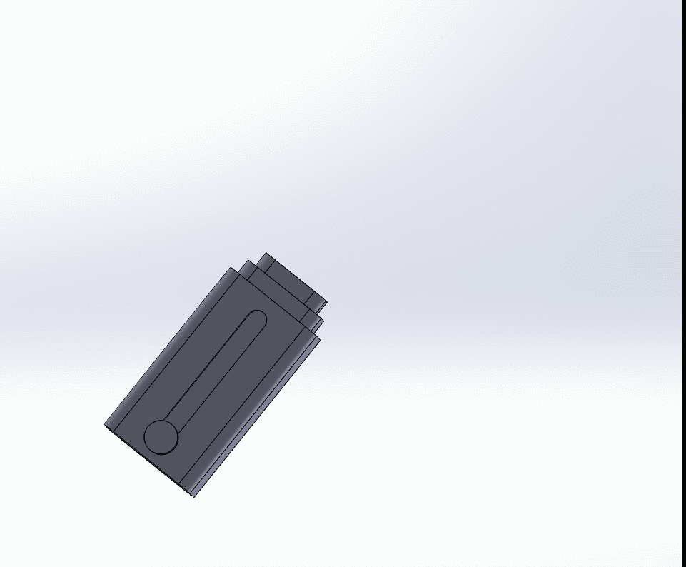
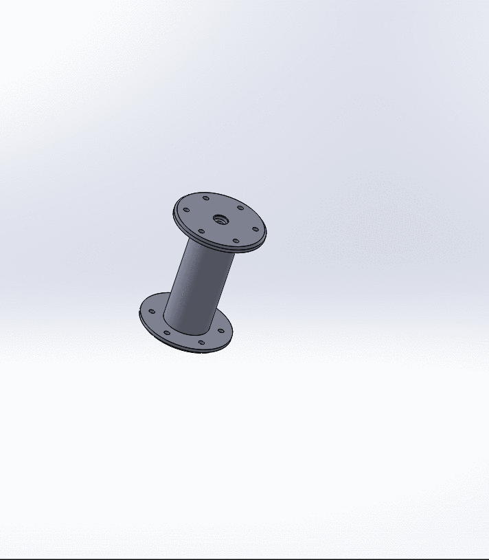

# Intermediate_CAD

## Advanced and Mechanical Mates
#### Included Files:
<a href="Advanced_and_Mechanical_Mates.SLDASM">Advanced_and_Mechanical_Mates.SLDASM</a> 
<a href="Advanced_and_Mechanical_Mates_1.SLDPRT">Advanced_and_Mechanical_Mates_1.SLDPRT</a> 
<a href="Pin.SLDPRT">Pin.SLDPRT</a> 

In this assignment I made a linear extender that is controlled with a pin. The body of the extender is made of three different versions of the same part. This assignment taught me how to use advanced mates in assemblies to make a more dynamic and functional CAD prototype.
 

  
 
Finishing this assembly and being able to use the slider to move the part was the most satisfying part of the Solidworks tutorials.

## Design Tables
#### Included Files:
<a href="Design_Tables.SLDPRT">Design_Tables.SLDPRT</a> 

For this assignment I made a "spool thingy" that has different configurations that allow you to make it in different sizes without having to recreate the whole part. In this I learned how using design tables can be much more efficient than redesigning a part from scratch.

  

I thought that this assignment was very tedious due to the amount of switching between tabs to check and copy the exact dimensions of each of the configurations of the spool.
