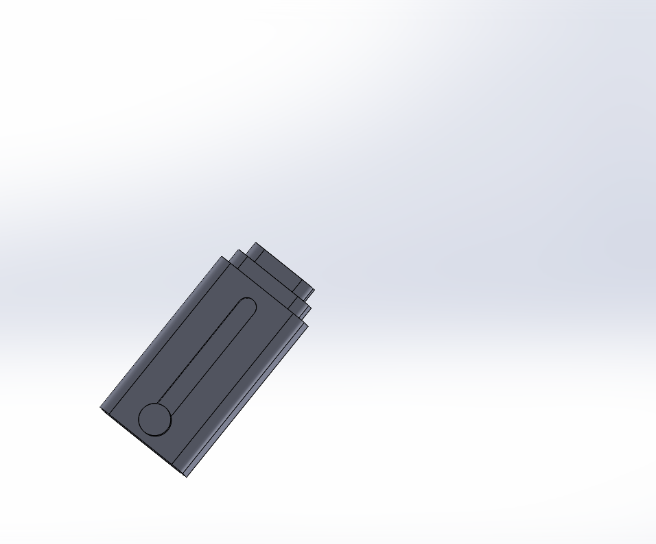
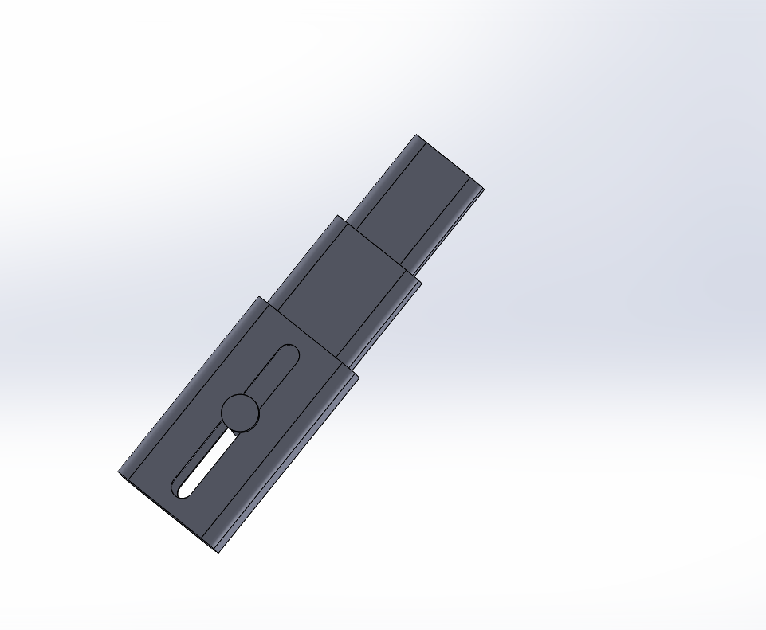
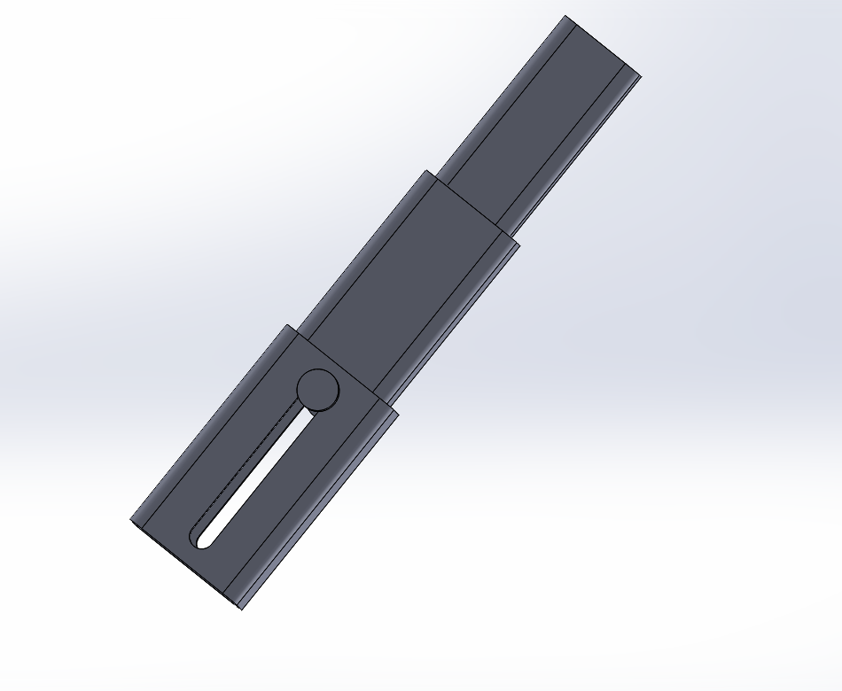

# Intermediate_CAD

### Advanced and Mechanical Mates Assembly:
Advanced_and_Mechanical_Mates.SLDASM   
 
For this assignment I mated all of the parts together with advanced mates that allowed them to move. This created a linear extender. 
This assignment taught me how to use Solidworks assemblies to make a more dynamic prototype. 
 

#### The linear extender compressed:

#### The linear extender extending:

#### The linear extender fully extended:

